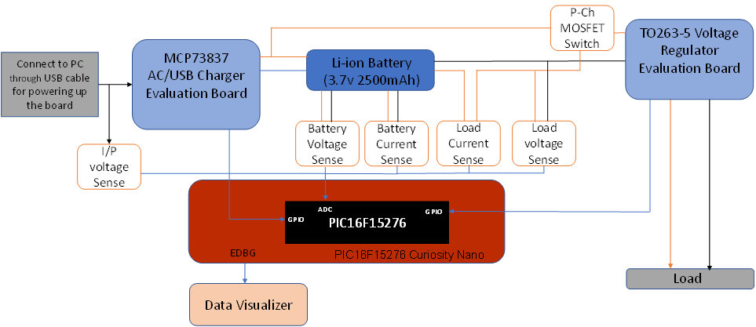
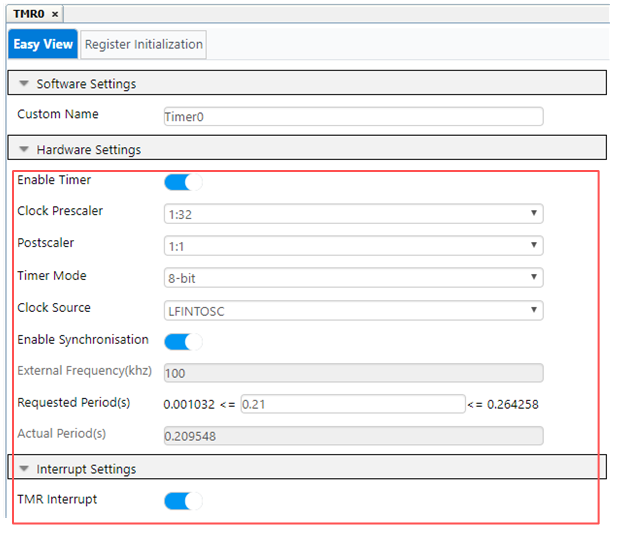

<!-- Please do not change this html logo with link -->

# Battery Monitoring System Using PIC16F15276 Microcontroller

Most of the embedded systems, including Internet of Things (IoT) systems which are deployed in remote location commonly uses battery as source of power. These battery-operated applications require battery charge to be monitored for the safe and reliable operation. The battery charge measurement is required to estimate the State of Charge (SoC) of the battery.

The PIC16F15276 microcontroller include 10-bit Analog-to-Digital Converter (ADC), Timer, and Enhanced Universal Synchronous Asynchronous Receiver Transmitter (EUSART) peripherals which can be used for realizing battery monitoring system application.

The ADC is used to convert the analog signals into digital, EUSART is used to communicate with the external integrated circuits. Additionally, the EUSART interface can communicate with Data visualizer, and Timer is used for scheduling the events.

This code example highlights the implementation of a Battery Monitoring System using PIC16F15276 microcontroller. It demonstrates how to measure battery charge and estimate the SoC of battery.

**Note: The designed circuit and code example is tested ONLY with the Li-Ion battery.**

## Related Documentation

- [PIC16F15244 Product Family Page](https://www.microchip.com/en-us/products/microcontrollers-and-microprocessors/8-bit-mcus/pic-mcus/pic16f15244)
- [PIC16F15244 Family Code Examples on GitHub](https://github.com/microchip-pic-avr-examples?q=pic16f152&type=&language=&sort=)
- [PIC16F15244 MCU Family Video](https://www.youtube.com/watch?v=nHLv3Th-o-s)
- [PIC16F15276 MCU Product Page](https://www.microchip.com/en-us/product/PIC16F15276)
- [PIC16F15276 Datasheet](http://www.microchip.com/40002305)
- [Reference Application Note (Simple LiPo Battery Management)](https://www.microchip.com/en-us/application-notes/an3531)

## Demo Description 

The Battery Monitoring System code example aims to measure the power drawn by connected load and estimate the SoC of the battery. A Lithium-ion Battery with 2500mAh capacity, MCP73837/8 AC/USB Dual Input Battery Charger Evaluation Board, TO220-5 Voltage Regulator Evaluation Board with MCP1826 LDO and measurement circuits are used in the code example for battery monitoring system demonstration.

The measurement circuits are built on MikroElektronika PROTO click using passive and active electronic components, to measure charging and discharging current of the battery and voltage across the input, battery, and load (load resistor). The Battery Charger Evaluation Board is used to charge the battery when the battery voltage goes below (certain) voltage and Voltage Regulator Evaluation Board is used to provide constant voltage of 0.8V to the load.

A passive voltage divider network, with two resistors connected in series is designed to scale down the voltage signal, which needs to be sampled by the ADC of PIC16F15276 microcontroller. So, the ADC input signal voltage is within the recommended range of 0 to 3.3V. The designed voltage divider network is capable of measuring voltage across the battery and load in the range of 0 to 5V.

The current mirror circuit generates the voltage signal in proportion to the current flow. The current mirror circuit is used to measure current in the range of 0 to 1A. This voltage signal is fed to the ADC of PIC16F15276 microcontroller to measure current through the battery terminal and current drawn by the load.

The Current Direction control is designed using a P-channel MOSFET, Schottky diode and Resistor. The current direction control circuit is used to switch the load source power. 
  
The SoC of battery can be estimated using the measured current and voltage values and then displayed on the custom dashboard window of data visualizer along with the measured voltage and current values.

  
   Figure 1 : Battery Monitoring System Block Diagram 

### Voltage Measurement Circuit

  
   Figure 2 : Voltage Measurement Circuit 

### Current Measurement Circuit

  
   Figure 3 : Current Measurement Circuit 

### Current Direction Control (MOSFET Switch)

  
   Figure 4 : Current Direction Control Circuit 

## Software Used

- MPLAB® X IDE [6.0.0 or newer](http://www.microchip.com/mplab/mplab-x-ide) 
- MPLAB® XC8 Compiler [2.36.0 or newer](http://www.microchip.com/mplab/compilers) 
- Microchip PIC16F1xxxx Series Device Support [1.9.163 or newer pack](https://packs.download.microchip.com/)
- MPLAB® Data Visualizer [1.3.1136 or newer](https://www.microchip.com/en-us/tools-resources/debug/mplab-data-visualizer)
- MPLAB® Code Configurator (MCC) [5.1.1 or newer](https://www.microchip.com/mplab/mplab-code-configurator) 
- ADC MCC Melody driver 3.0.6
- TMR0 MCC Melody driver 4.0.8
- UART MCC Melody driver 1.6.0
- GPIO/Pins drivers MCC Melody driver 3.2.2

## Hardware Used

- Lithium-ion Battery
   - Nominal discharge capacity: 2500mAh
   - Nominal voltage: 3.6V
   - Maximum charge voltage: 4.10 to 4.20V
- [MCP73837/8 AC/USB Dual Input Battery Charger Evaluation Board](https://www.microchip.com/en-us/development-tool/mcp7383xev-dibc)
- [MCP73837](https://www.microchip.com/en-us/product/MCP73837)
- [TO220-5 Voltage Regulator Evaluation Board](https://www.microchip.com/en-us/development-tool/TO263-5EV-VREG)
- [MCP1826](https://www.microchip.com/en-us/development-tool/TO263-5EV-VREG)
- [PIC16F15276 Curiosity Nano Board](https://www.microchip.com/en-us/development-tool/EV09Z19A)
- [Curiosity Nano Base for Click Boards](https://www.microchip.com/en-us/development-tool/AC164162)
- [PROTO click](https://www.mikroe.com/proto-click)

## Hardware Setup

The PIC16F15276 Curiosity Nano evaluation kit along with Curiosity nano base for click boards, two PROTO click boards, battery, battery charger evaluation board and regulator evaluation board are used to setup the battery monitoring system. The PIC16F15276 curiosity Nano kit and the PROTO clicks are mounted on the Curiosity Nano base for Click boards. The following figure shows hardware setup of the demonstrator. Refer hardware connection details table for more information about the required connections among these boards.

  
   Figure 5 : Battery Monitoring System Hardware Setup 

### Hardware Connection Details

|Sl No. | Microcontroller pin | Pin Configuration | Signal name |I/O Pin Direction |
|:---------:|:----------:|:-----------:|:---------:|:------------:|	
| 1     | RD3	| ADC Channel	        | AND3	| IN  |	
| 2     | RD4	| ADC Channel	        | AND4	| IN  |
| 3     | RD0	| ADC Channel	        | AND0	| IN  |
| 4     | RD7	| ADC Channel           | AND7	| IN  |
| 5     | RD1	| ADC Channel           | AND1	| IN  |
| 6     | RC7	| GPIO Pin              | PC7	| IN |
| 7     | RA6	| GPIO Pin              | PA6	| OUT |
| 8     | RB0	| EUSART Tx1 Pin        | TX	| OUT |
| 9     | RB1	| EUSART Rx1 Pin        | RX	| IN |
	
## Steps to open Terminal window in Data Visualizer

The data visualizer tool is used as a graphical user interface while demonstrating the application by displaying the voltage, current and SoC information. Pre-configured data streamer file and custom dashboard file are available with the firmware package. The below steps are given for data visualizer configuration using these files to prepare the setup.

### Data Visualizer Serial Port Configuration

1. Open the standalone data visualizer. Refer [Data Visualizer Software User’s Guide](https://www.microchip.com/DS40001903B) for installation and features.

  
   Figure 6 : Standalone Data Visualizer icon 

2.	In the data visualizer window, click on Configuration tab.

  
   Figure 7 : Data Visualizer Configuration Window 

3.	In the Modules section, expand External connection option and then double click on Serial port.

  
   Figure 8 : Data Visualizer Modules Window 

4.	From Serial Port Control Panel, select the Curiosity Virtual Com Port which is connected to the host device.

  
   Figure 9 : Data Visualizer Serial Control Panel 

### Data Streamer Configuration

1.	Configure the data streamer for interfacing the dashboard window with the serial port control panel.
2.	To open data stream control panel, open the Configuration tab located on the left side of the data visualizer tool, expand Protocols, and click the Data Streamer, Data Streamer window that appears, as shown in Figure 10.
3.	Click the ‘...’ symbol in the Data Stream control panel window, set an appropriate path for the provided data streamer file from the host computer, as shown in Figure 10.

  
   Figure 10 : Data Visualizer Data streamer configure window 

4.	Click Load in the data streamer control panel window, as shown in Figure 10. The Data Streamer window will load with ports, as shown in Figure 11.

  
   Figure 11 : Data Visualizer Data streamer control panel 

5.	Drag COM0 output of the Serial Port control panel window and drop on to Source port of data streamer control panel window, as shown in Figure 12.

  
   Figure 12 : Connection between Serial Port and Data Streamer Window 

### Custom Dashboard Configuration 

1.	Configure the custom dashboard window to display the battery monitoring information. 
2.	To open the custom dashboard window, open the Configuration tab located on the left side of the data visualizer tool, expand Visualization, and click Custom Dashboard that appears as shown in Figure 13.

  
   Figure 13 : Custom Dashboard Window 

3.	Check Edit below the dashboard I/O window, click Load, and set the appropriate path for the provided custom dashboard file from the host computer, as shown in Figure 14.

  
   Figure 14 : Battery Monitoring System Custom Dashboard Window 

4.	Check Show Endpoints below the dashboard I/O window.
5.	Drag the appropriate port pins from the Data Streamer control panel and drop onto the respective endpoints, as shown in the Figure 15.

  
   Figure 15 : Data Visualizer Connection Reference Diagram 

## Demo Operation

1.	Connect the hardware and prepare the demonstrator setup, follow the steps provided in Hardware Setup section to setup the hardware.
2.	Configure the data visualizer, follow the instructions provided in the Data Visualizer Configuration section.
3.	Click the Serial Port Control Panel Connect button.
4.	Monitor the following features on the custom window of the data visualizer.
    - Battery Voltage 
    - Load Voltage
    - Battery Charging Current 
    - Load Current
    - State of Charge (0 - 100%)
    - Battery Capacity Level (0 – 100%) 

## MCC Configuration

### Clock Module:

- System Clock: 32MHz
- Clock Source: HFINTOSC

  
   Figure 16 : Clock Module Window 

 
### Configuration Bits:

- Default Value for COSC bits: HFINTOSC (32MHz) 

  
   Figure 17 : Configuration Bits Window 

### ADC: 
- Positive Reference: VDD
- Result Alignment: Right
- Clock Source: FOSC/32

  
   Figure 18 : ADC Configuration Window 

### EUSART:
- Baud Rate: 56000

  
   Figure 19 : EUSART Configuration Window 

### TMR0:
- Clock Prescaler: 1:32
- Post scaler: 1:1
- Clock Source: LFINTOSC
- Requested Period(s): 0.20 (20ms)

  
   Figure 20 : TMR0 Configuration Window 

### Pin Grid View 

  
   Figure 21 : Pin Grid View Window 

### Pins 

  
   Figure 22 : Pins Window 

